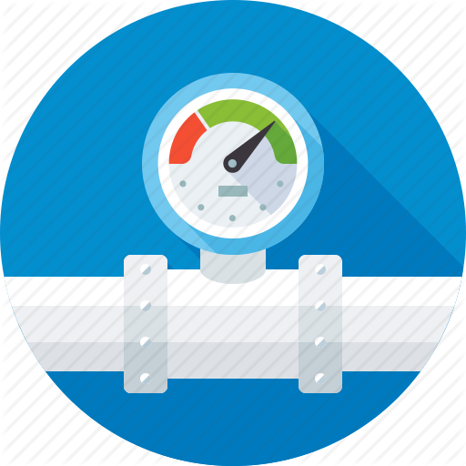

## Page based - Contoso Ltd. Case Study

## Consumption-Based Usage

This is best capability ever for us here at the Contoso, only paying for what we consume!!  We have systems designed to take a ton of load, but often they are sitting there idle.  During the last shopping season we had more than a 1000 servers just waiting to collect and process data.  Waiting being the operative word, because we were paying for them even when they set idle.

This ability to build out the application, deploy it to cloud, and only pay for it when and how it is being used is great.  We can have one server deployed and waiting for users and pay for a small amount.  Then when more users start connecting in peak shopping times, we just add a few extra servers to our site.  Pay for them while they work, and then disconnect them, when not needed.

This model of just paying for what we use will save us money and time, and reduce the cost of our programs.
