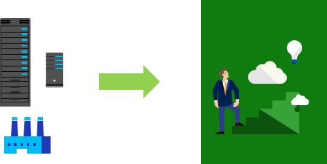

## Consumption-based model

Cloud service providers operate on a **consumption-based model**, which means that end users only pay for the resources that they use. Whatever they use is what they pay for.

This consumption-based model brings with it many benefits, including:

+ No upfront costs.

+ No need to purchase and manage costly infrastructure that they may or may not use to its fullest.

+ The ability to pay for additional resources when they are needed.

+ The ability to stop paying for resources that are no longer needed.

This also allows for better cost prediction. Prices for individual resources and services are provided so you can predict how much you will spend in a given billing period based on your expected usage. You can also perform analysis based on future growth using historical usage data tracked by your cloud provider.