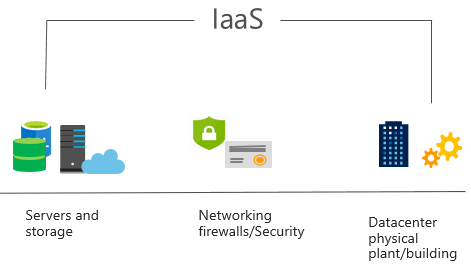

## Infrastructure as a Service

Infrastructure as a Service (IaaS) is the most basic category of cloud computing services. With IaaS, you rent IT infrastructure servers and virtual machines (VMs), storage, networks, and operating systems from a cloud provider on a pay-as-you-go basis. It's an instant computing infrastructure, provisioned and managed over the internet.

## IaaS characteristics

+ **Upfront costs**. IaaS has no upfront costs. Users pay only for what they consume.

+ **User ownership**. The user is responsible for the purchase, installation, configuration, and management of their own software operating systems, middleware, and applications.

+ **Cloud provider ownership**. The cloud provider is responsible for ensuring that the underlying cloud infrastructure (such as virtual machines, storage and networking) is available for the user.
 

## Common usage scenarios:

+ **Migrating workloads**. Typically, IaaS facilities are managed in a similar way as on-premises infrastructure and provide an easy migration path for moving existing applications to the cloud. 

+ **Test and development**. Teams can quickly set up and dismantle test and development environments, bringing new applications to market faster. IaaS makes scaling development testing environments up and down fast and economical.

+ **Website hosting**. Running websites using IaaS can be less expensive than traditional web hosting.

+ **Storage, backup, and recovery**. Organizations avoid the capital outlay and complexity of storage management, which typically requires a skilled staff to manage data and meet legal and compliance requirements. IaaS is useful for managing unpredictable demand and steadily growing storage needs. It can also simplify the planning and management of backup and recovery systems.

✔️ When using IaaS, ensuring that a service is up and running is a shared responsibility: the cloud provider is responsible for ensuring the cloud infrastructure is functioning correctly; the cloud customer is responsible for ensuring the service they are using is configured correctly, is up to date, and is available to their customers. 
