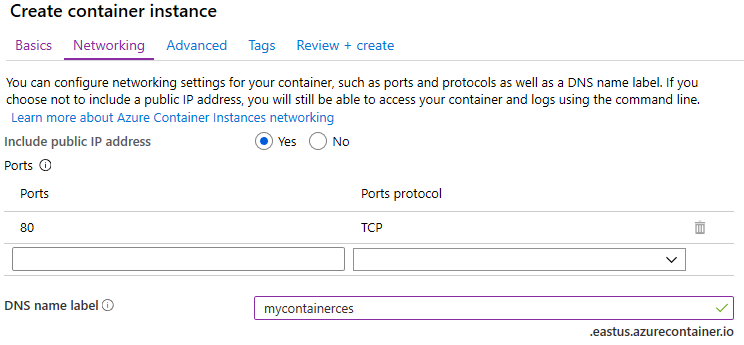

## Exercise - Container Instances

> [!NOTE]
> This Lab requires an Azure subscription. It will not function in the Azure Sandbox you have used for other labs.  You will need to use your own free Azure account to complete the steps of the lab.

---

## Lab 02 - Deploy Azure Container Instances

In this walkthrough we create, configure, and deploy a Docker container by using Azure Container Instances (ACI) in the Azure Portal. The container is a Welcome to ACI web application that displays a static HTML page. 

### Task 1: Create a container instance

In this task, we will create a new container instance for the web application. 

1. Sign in to the [Azure portal (https://portal.azure.com)](https://portal.azure.com?azure-portal=true).

2. From the **All services** blade, search for and select **Container instances** and then click **+ Add**. 

3. Provide the following Basic details for the new container instance  (leave the defaults for everything else)): 

	| Setting| Value|
	|----|----|
	| Subscription | Ensure **Concierge Subscription** |
	| Resource group | **[sandbox resource group name]** |
	| Container name| **mycontainer**|
	| Region | **(US) East US** |
	| Image source| **Docker Hub or other registry**|
	| Image type| **Public**|
	| Image| **microsoft/aci-helloworld**|
	| OS type| **Linux** |
	| Size| ***Leave at the default***|
	|||

4. Configure the Networking tab (replace **xxxx** with letters and digits such that the name is globally unique). Leave all other settings at their default values .

	| Setting| Value|
	|--|--|
	| DNS name label| **mycontainerdnsxxxx** |
	|||
	
	> [!NOTE]
	> Your container will be publicly reachable at dns-name-label.region.azurecontainer.io. If you receive a **DNS name label not available** error message following the deployment, specify a different DNS name label and re-deploy.

	

5. **FAIL in Sandbox from this point forward** Click **Review and Create** to start the automatic validation process.

6. Click **Create** to create the container instance. 

7. Monitor the deployment page and the **Notifications** page. 

8. While you wait you may be interested in viewing the [sample code behind this simple application](https://github.com/Azure-Samples/aci-helloworld). Browse the \app folder. 

### Task 2: Verify deployment of the container instance

In this task, we verify that the container instance is running by ensuring that the welcome page displays.

1. After the deployment is complete, click the **Go to resource** link the deployment blade or the link to the resource in the Notification area.

2. On the **Overview** blade of **mycontainer**, ensure your container **Status** is **Running**. 

3. Locate the Fully Qualified Domain Name (FQDN).

	

2. Copy the container's FQDN into the URL text box web browser and press **Enter**. The Welcome page should display. 

	

> [!NOTE]
> You could also use the container IP address in your browser. 

Congratulations! You have used Azure Portal to successfully deploy an application to a container in Azure Container Instance.

> [!NOTE]
> To avoid additional costs, you can remove this resource group. Search for resource groups, click your resource group, and then click **Delete resource group**. Verify the name of the resource group and then click **Delete**. Monitor the **Notifications** to see how the delete is proceeding.