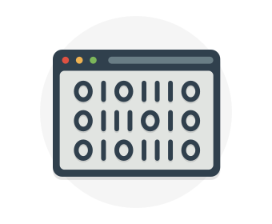
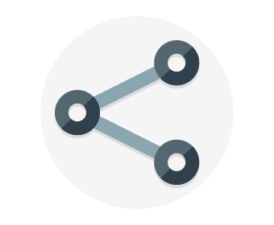
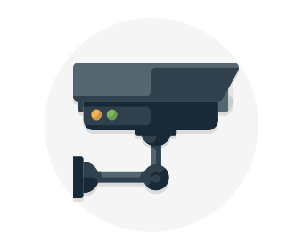

## Defense in depth

**Defense in depth** is a strategy that employs a series of mechanisms to slow the advance of an attack aimed at acquiring unauthorized access to data. The objective of defense in depth is to protect and prevent information from being stolen by individuals not authorized to access it. The common principles used to define a security posture are **confidentiality**, **integrity**, and **availability**, known collectively as CIA.

+ **Confidentiality** - The Principle of least privilege restricts access to information only to individuals explicitly granted access. This information includes protection of user passwords, remote access certificates, and email content.
+ **Integrity** - The prevention of unauthorized changes to information at rest or in transit. A common approach used in data transmission is for the sender to create a unique fingerprint of the data using a one-way hashing algorithm. The hash is sent to the receiver along with the data. The data's hash is recalculated and compared to the original by the receiver to ensure the data wasn't lost or modified in transit.
+ **Availability** - Ensure services are available to authorized users. Denial of service attacks are a prevalent cause of loss of availability to users.

Defense in depth can be visualized as a set of layers, with the Data to be secured at the center. Each layer provides protection so that if one layer is breached, a subsequent layer is already in place to prevent further exposure. This approach removes reliance on any single layer of protection and acts to slow down an attack and provide alert telemetry that can be acted upon, either automatically or manually.

+ **Physical security** is the first line of defense to protect computing hardware in the datacenter. 
+ **Identity & access** controls access to infrastructure and change control. 
+ **Perimeter** layer uses distributed denial-of-service (DDoS) protection to filter large-scale attacks before they can cause a denial of service for end users.
+ **Networking** layer limits communication between resources through segmentation and access controls.
+ **Compute** layer secures access to virtual machines.
+ **Application** layer ensures applications are secure and free of vulnerabilities.

---

:::row:::
  :::column:::
    
  :::column-end:::
  :::column span="3":::  
**Data**

In almost all cases, attackers are after data:

- Stored in a database
- Stored on disk inside virtual machines
- Stored on a SaaS application such as Office 365
- Stored in cloud storage

It's the responsibility of those storing and controlling access to data to ensure that it's properly secured. Often, there are regulatory requirements that dictate the controls and processes that must be in place to ensure the confidentiality, integrity, and availability of the data.
  :::column-end:::
:::row-end:::

:::row:::
  :::column:::
    
  :::column-end:::
  :::column span="3":::  
**Application**

- Ensure applications are secure and free of vulnerabilities.
- Store sensitive application secrets in a secure storage medium.
- Make security a design requirement for all application development.

Integrating security into the application development life cycle will help reduce the number of vulnerabilities introduced in code. We encourage all development teams to ensure their applications are secure by default, and that they're making security requirements non-negotiable.
  :::column-end:::
:::row-end:::

:::row:::
  :::column:::
    
  :::column-end:::
  :::column span="3":::  
**Compute**

- Secure access to virtual machines.
- Implement endpoint protection and keep systems patched and current.

Malware, unpatched systems, and improperly secured systems open your environment to attacks. The focus in this layer is on making sure your compute resources are secure, and that you have the proper controls in place to minimize security issues.
  :::column-end:::
:::row-end:::

:::row:::
  :::column:::
    
  :::column-end:::
  :::column span="3":::  
**Networking**

- Limit communication between resources.
- Deny by default.
- Restrict inbound internet access and limit outbound, where appropriate.
- Implement secure connectivity to on-premises networks.

At this layer, the focus is on limiting the network connectivity across all your resources to allow only what is required. By limiting this communication, you reduce the risk of lateral movement throughout your network.
  :::column-end:::
:::row-end:::

:::row:::
  :::column:::
    
  :::column-end:::
  :::column span="3":::  
**Perimeter**

- Use distributed denial of service (DDoS) protection to filter large-scale attacks before they can cause a denial of service for end users.
- Use perimeter firewalls to identify and alert on malicious attacks against your network.

At the network perimeter, it's about protecting from network-based attacks against your resources. Identifying these attacks, eliminating their impact, and alerting you when they happen are important ways to keep your network secure.
  :::column-end:::
:::row-end:::

:::row:::
  :::column:::
    
  :::column-end:::
  :::column span="3":::  
**Identity and access**

- Control access to infrastructure and change control.
- Use single sign-on and multi-factor authentication.
- Audit events and changes.

The identity and access layer is all about ensuring identities are secure, access granted is only what is needed, and changes are logged.
  :::column-end:::
:::row-end:::

:::row:::
  :::column:::
    
  :::column-end:::
  :::column span="3":::  
**Physical security**

- Physical building security and controlling access to computing hardware within the data center is the first line of defense.

With physical security, the intent is to provide physical safeguards against access to assets. These safeguards ensure that other layers can't be bypassed, and loss or theft is handled appropriately.
  :::column-end:::
:::row-end:::

Azure helps alleviate your security concerns. But security is still a **shared responsibility**. How much of that responsibility falls on us depends on which model we use with Azure. We use the *defense in depth* rings as a guideline for considering what protections are adequate for our data and environments.

✔️ Microsoft applies a layered approach to security, both in our physical datacenters and across Azure services. 
