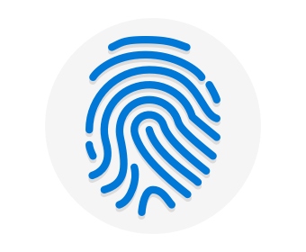

#Azure Active Directory (Azure AD)

[Azure Active Directory](https://azure.microsoft.com/services/active-directory?azure-portal=true) is a Microsoft cloud-based identity and access management service. Azure AD helps employees of an organization sign in and access resources:

+ **External resources** might include Microsoft Office 365, the Azure portal, and thousands of other software as a service (SaaS) applications.
+ **Internal resources** might include apps on your corporate network and intranet, along with any cloud apps developed by your own organization.

Azure AD provides services such as:

+ **Authentication**. This includes verifying identity to access applications and resources, and providing functionality such as self-service password reset, multi-factor authentication (MFA), a custom banned password list, and smart lockout services.

+ **Single-Sign-On** (SSO). SSO enables users to remember only one ID and one password to access multiple applications. A single identity is tied to a user, simplifying the security model. As users change roles or leave an organization, access modifications are tied to that identity, greatly reducing the effort needed to change or disable accounts.

+ **Application management**. You can manage your cloud and on-premises apps using Azure AD Application Proxy, SSO, the My apps portal (also referred to as *Access panel*), and SaaS apps.

+ **Business to business** (B2B) identity services. Manage your guest users and external partners while maintaining control over your own corporate data

+ **Business-to-Customer** (B2C) identity services. Customize and control how users sign up, sign in, and manage their profiles when using your apps with services.

+ **Device Management**. Manage how your cloud or on-premises devices access your corporate data.

Azure AD is intended for:

+ **IT administrators**. Administrators can use Azure AD to control access to apps and their resources, based on your business requirements.

+ **App developers**. Developers can use Azure AD to provide a standards-based approach for adding functionality to applications that you build, such as adding Single-Sign-On functionality to an app, or allowing an app to work with a user's pre-existing credentials and other functionality.

+ **Microsoft 365**, **Microsoft Office 365**, **Azure**, or **Microsoft Dynamics CRM Online** subscribers. These subscribers are already using Azure AD. Each Microsoft 365, Office 365, Azure, and Dynamics CRM Online tenant is automatically an Azure AD tenant. You can immediately start to manage access to your integrated cloud apps using Azure AD.

Let's explore a single sign-on in more detail.

## Single sign-on

The more identities a user has to manage, the greater the risk of a credential-related security incident. More identities mean more passwords to remember and change. Password policies can vary between applications and, as complexity requirements increase, it becomes increasingly difficult for users to remember them.

Now, consider the logistics of managing all those identities. Additional strain is placed on help desks as they deal with account lockouts and password reset requests. If a user leaves an organization, tracking down all those identities and ensuring they are disabled can be challenging. If an identity is overlooked, this could allow access when it should have been eliminated.

With single sign-on (SSO), users need to remember only one ID and one password. Access across applications is granted to a single identity tied to a user, simplifying the security model. As users change roles or leave an organization, access modifications are tied to the single identity, greatly reducing the effort needed to change or disable accounts. Using single sign-on for accounts will make it easier for users to manage their identities and will increase the security capabilities in your environment.

:::row:::
  :::column:::
    
  :::column-end:::
  :::column span="3":::
**SSO with Azure Active Directory**

By leveraging Azure AD for SSO you'll also have the ability to combine multiple data sources into an intelligent security graph. This security graph enables the ability to provide threat analysis and real-time identity protection to all accounts in Azure AD, including accounts that are synchronized from your on-premises AD. By using a centralized identity provider, you'll have centralized the security controls, reporting, alerting, and administration of your identity infrastructure.

As Contoso Shipping integrates its existing Active Directory instance with Azure AD, you will make controlling access consistent across the organization. Doing so will also greatly simplify the ability to sign into email and Office 365 documents without having to reauthenticate.
  :::column-end:::
:::row-end:::

