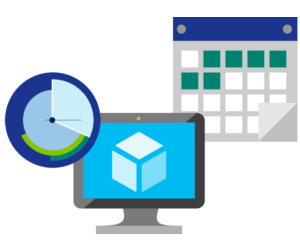

## Usage meters

When you provision an Azure resource, Azure creates one or more meter instances for that resource. The meters track the resources' usage, and each meter generates a usage record that is used to calculate your bill.

For example, a single virtual machine that you provision in Azure might have the following meters tracking its usage:

- Compute Hours
- IP Address Hours
- Data Transfer In
- Data Transfer Out
- Standard Managed Disk
- Standard Managed Disk Operations
- Standard IO-Disk
- Standard IO-Block Blob Read
- Standard IO-Block Blob Write
- Standard IO-Block Blob Delete

The following sections describe the main factors that affect Azure costs, including resource type, services, and the user's location.

## Resource type

Costs are resource-specific, so the usage that a meter tracks and the number of meters associated with a resource depend on the resource type.

**Note**: Each meter tracks a specific type of usage.  For example, a meter might track bandwidth usage (ingress or egress network traffic in bits-per-second), number of operations, size (storage capacity in bytes), or similar items.

The usage that a meter tracks correlates to a quantity of billable units. Those are charged to your account for each billing period, and the rate per billable unit depends on the resource type you are using.

## Services

Azure usage rates and billing periods can differ between Enterprise, Web Direct, and Cloud Solution Provider (CSP) customers. Some subscription types also include usage allowances, which affect costs.

The Azure team develops and offers first-party products and services, while products and services from third-party vendors are available in the Azure marketplace.  Different billing structures apply to each of these categories.

## Location

The Azure infrastructure is globally distributed, and usage costs might vary between locations that offer Azure products, services, and resources.

For example, you might want to build your Azure solution by provisioning resources in locations that offer the lowest prices, but this would require transferring data between locations, if dependent resources and their users are located in different parts of the world. If there are meters tracking the volume of data that transfers between the resources you provision, any potential savings you make from choosing the cheapest location could be offset by the additional cost of transferring data between those resources.

**Note**: For more information about Azure usage charges, refer to [Understand terms on your Microsoft Azure invoice](https://docs.microsoft.com/azure/billing/billing-understand-your-invoice?azure-portal=true).
