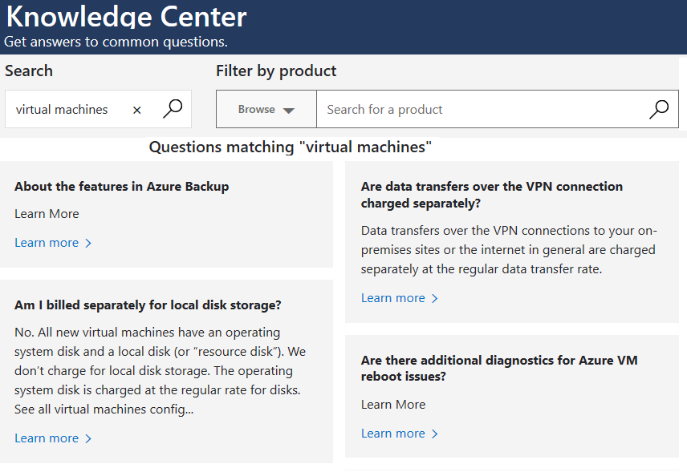

## Azure Knowledge Center

The [Knowledge Center](https://azure.microsoft.com/resources/knowledge-center?azure-portal=true) is a searchable database that contains answers to common support questions, from a community of Azure experts, developers, customers, and users.

You can browse through all answers within the Azure Knowledge Center.  Find specific solutions by entering keyword search terms into the text-entry field and further refine your search results by selecting products or tags from the lists provided by two dropdown lists.

